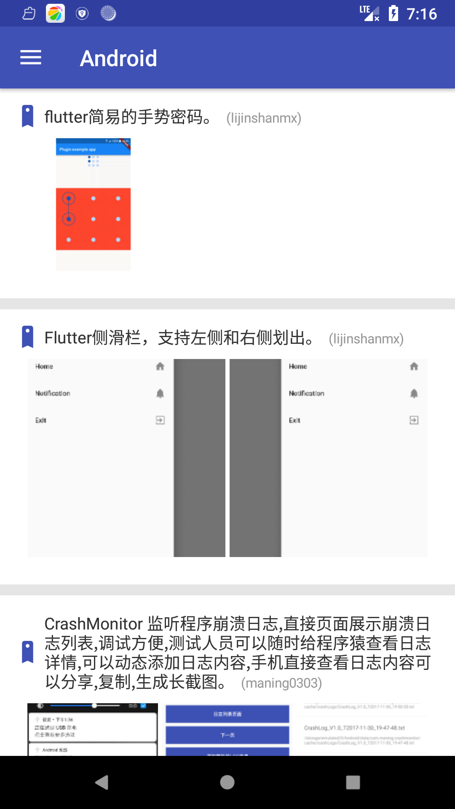

# Meizikt

> Gank.io Android客户端 使用Kotlin + Retrofit2 + Rx

### 数据来源：

  本应用所有数据均来自[干货集中营](http://gank.io/)的开放API。
  
### 应用简介：
  Meizikt，随时随地了解最新技(piao)术(liang)动(mei)态(zi)。除周末部分节假日外，每日更新一个美图，一个小视频，以及各类技术最新文章。

### 截图





### 第三方Libs
```
    implementation 'cn.bingoogolapple:bga-refreshlayout:1.1.8@aar'
    implementation 'me.drakeet.multitype:multitype-kotlin:3.4.4'
    implementation 'com.github.bumptech.glide:glide:4.7.1'
    kapt 'com.github.bumptech.glide:compiler:4.7.1'
    implementation 'com.jaeger.ninegridimageview:library:1.1.1'
    implementation 'com.github.chrisbanes:PhotoView:2.1.4'
    implementation 'com.just.agentweb:agentweb:4.0.2' // (必选)
    implementation 'com.tbruyelle.rxpermissions2:rxpermissions:0.9.5@aar'

    //leakcanary内存泄漏检测
    debugImplementation 'com.squareup.leakcanary:leakcanary-android:1.5.4'
    releaseImplementation 'com.squareup.leakcanary:leakcanary-android-no-op:1.5.4'
```

----

_by [@wangsz](https://wangshouz.github.io/)
